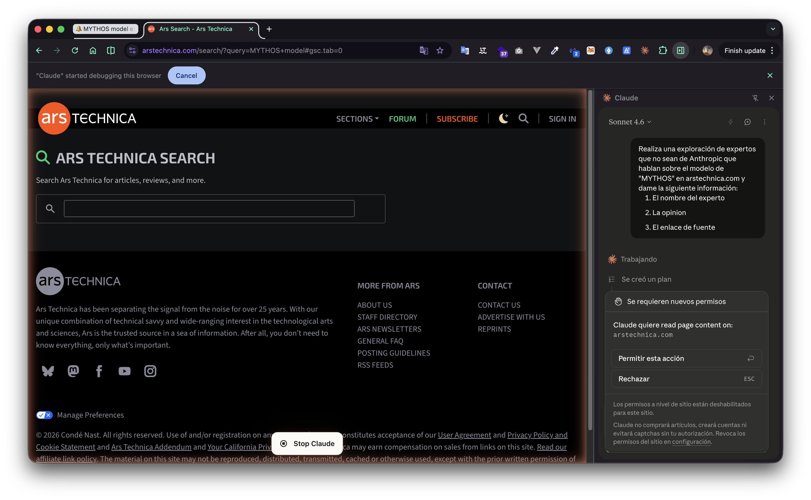

> **tl;dr** Claude es ideal para una exploración rápida, Claude Code para codificación y generación de subagentes, y Claude Cowork para integrar herramientas de ofimática (hojas de cálculo y dashboards sencillos).

**Manifiesto de ética**

*Es importante mencionar que estas son herramientas de [LLM](https://arstechnica.com/ai/2024/12/why-ai-language-models-choke-on-too-much-text/), y se deben pensar siempre como una reconstrucción de colecciones de razonamientos aleatorios, o también pueden verse como una configuración de sistemas [estocásticos](https://dle.rae.es/estoc%C3%A1stico), las cuales pueden confluir en razonamientos muy bien estructurados o también pueden llegar a encontrarse con ruido que les llevará a respuestas erróneas y con alucinaciones (que no quedes como un alucín).*

*Por cuanto debes tener una responsabilidad perentoria en la revisión de cada una de sus afirmaciones, corroborando con fuentes de rigor (fuentes indexadas, estándares internacionales, etc).*

Es muy probable que te encuentres atosigado por la gran cantidad de información sobre herramientas de IA, y la "infoxicación" en redes sociales puede llegar a confundirte y terminar gastando en una suscripción que nunca le darás uso.

---
<iframe
  width="100%"
  style="aspect-ratio: 9/16; max-width: 400px; display: block; margin: 0 auto;"
  src="https://www.youtube.com/embed/X7bsQgrNdgg"
  title="OpenClaw - Estado del Arte"
  frameborder="0"
  allow="accelerometer; autoplay; clipboard-write; encrypted-media; gyroscope; picture-in-picture"
  allowfullscreen>
</iframe>

---

De entre toda esa nube de marketing de patito, nos podemos encontrar con joyas como Claude, que destaca por su filosofía, y [por oponerse al gobierno del señor naranja](https://arstechnica.com/tech-policy/2026/03/anthropic-sues-us-over-blacklisting-white-house-calls-firm-radical-left-woke/) en pro de la protección de la privacidad de sus clientes (válido solo para estadounidenses), y muy seguramente [ya no vuelvas a usar ChatGPT](https://x.com/rubenhassid/status/2024871775574593798).

Pero ¿qué nos ofrece Claude? Podemos simplificarlo así:

1. Herramientas para personas no técnicas y
2. Herramientas para personas técnicas.

Pero dicha clasificación pierde interés y desaprovecha la potencialidad que tienen muchas de sus herramientas. Otra manera de clasificar los productos de Claude puede ser por sus [modelos de LLM](https://platform.claude.com/docs/es/about-claude/models/overview), como los actualmente desarrollados o en ambiente de calidad a día de hoy (abril del 2026):
1. **Opus 4.6** — Su modelo más inteligente, orientado a la construcción de agentes y al uso en la codificación.
2. **Sonnet 4.5** — Un modelo enfocado en la velocidad e inteligencia, ideal para tareas que requieren equilibrio entre rendimiento y latencia.
3. **Haiku 4.5** — Su modelo más rápido con inteligencia casi de frontera, usado para aplicaciones que tienen un enfoque en la velocidad.

Y también se debe mencionar a uno de sus modelos en tendencia —generada por los propios de Anthropic— llamado ["Mythos"](https://red.anthropic.com/2026/mythos-preview/), enfocado en identificar y explotar vulnerabilidades de seguridad en sistemas tan críticos como OpenBSD, FFmpeg, el kernel de Linux o navegadores web.

Aunque se debe ser escéptico, ya que se sabe muy bien que el marketing puede engañarte al momento de venderte un producto, y hasta que un cliente directo lo pruebe [dichas afirmaciones deben tomarse con cautela](https://www.cnbc.com/2026/04/07/anthropic-claude-mythos-ai-hackers-cyberattacks.html).

Pero para no desviarnos del tema principal, yo clasificaría los productos de Claude de la siguiente manera:

1. Claude (a secas)
2. Claude Code
3. Claude Cowork

Que son los productos finales con los que la gente trabaja diariamente, y es más importante saber cómo utilizar la herramienta día a día que saber cuál es el modelo de frontera más "inteligente".

## 1. Claude (a secas)
Todos lo conocen como el clásico chat donde tú preguntas y él responde, y en el cual alimentas un contexto y de acuerdo con él puedes obtener cierta información o formatos de salida.

### ¿Para qué usarlo?
Lo ideal sería para tareas específicas y bien definidas, una investigación rápida, una exploración de información, o diseños de mapas y esquemas iniciales, petición de cálculos rápidos y elasticidad de contextos.

Por ejemplo, en la [propia documentación de Claude](https://claude.com/resources/use-cases) sugiere utilizarlo para: revisar y redlinear contratos legales, convertir investigaciones en presentaciones, planificar revisiones de literatura científica, analizar datos financieros bajo distintos escenarios, o simplemente como asistente personal para organizar ideas y tareas cotidianas.

### Claude Embebido
Estas son extensiones de Claude para un software en específico como Excel o Chrome. Por ejemplo, [la extensión de Claude para Excel](https://claude.com/resources/use-cases/update-your-financial-model-after-earnings) puede ayudar a realizar un proceso de limpieza de datos, un análisis exploratorio o paneles (dashboard) de estadísticas completos.

Mientras que la extensión para Chrome ayuda a interactuar con el navegador directamente: puede leer tu calendario y prepararte para reuniones, limpiar correos promocionales del inbox, extraer métricas de dashboards de analítica sin exportar nada, comparar productos entre pestañas abiertas, organizar archivos en Google Drive, o registrar llamadas de ventas en tu CRM.

Por ejemplo, utilizando la extensión se puede realizar una exploración e investigación sobre un tema específico (que es una aplicación recomendable).

## 2. Claude Code
En este punto pasas de ser un novato de los prompts a utilizar configuraciones donde puedes delimitar de mejor forma el contexto de lo que quieres realizar, y además afinar los formatos de salida que requieres.

> "Por favor no es necesario que hagas un diplomado, con leer la documentación oficial es suficiente :)"

Antes que nada debes tener en cuenta las [mejores prácticas](https://code.claude.com/docs/es/best-practices) para utilizar esta herramienta, pero antes es importante conocer el bucle agéntico, el cual sigue los siguientes pasos:

1. Tomar un contexto (archivos, prompts y conversaciones pasadas)
2. Tomar una acción
3. Verificar los resultados

Este bucle puede interrumpirse las veces que quieras para guiar al modelo hacia otros contextos (otras ideas) de acuerdo a lo que estés buscando.

Con ello, las mejores prácticas y patrones a seguir es tratar de mantener una ventana de contexto acotada; puedes apoyarte en los subagentes o MCP para este cometido.

<iframe style="border:none" width="100%" height="450" src="https://whimsical.com/embed/Fc8srTJQsux3R56o59Z7Wi"></iframe>

Otra buena práctica es definir muy bien la entrada y el formato de salida para reducir el uso de tokens. Y aunque no es una regla general, evita darle acceso directo a credenciales, API keys, WS keys u otros accesos de producción (puedes usar variables de entorno o bien accesos en ambiente de prueba).

Pero me extendí un poco en el cómo usarlo, y en realidad la pregunta es cuándo usarlo. La respuesta es sencilla: cuando necesites crear un desarrollo más elaborado.

Puedes usar la línea de terminal para escribir cientos de líneas de código, arquitecturas, patrones de diseño, estructuras de datos, y de una forma rápida.

### ¿Para qué usarlo?
Cuando necesites crear un desarrollo más elaborado que una simple consulta en el chat. A diferencia de Claude (chat), aquí el modelo tiene acceso completo a tu proyecto y puede leer, crear y modificar archivos directamente. Algunos casos concretos:

- **Generación de código**: escribir cientos de líneas, estructuras de datos, patrones de diseño y arquitecturas completas desde cero.
- **Bases de datos**: diseñar esquemas, generar migraciones y poblar datos de prueba.
- **Automatización con subagentes**: delegar tareas mecánicas a agentes independientes que trabajan en paralelo con microcontextos propios, sin saturar el contexto principal.
- **Integración con herramientas externas vía MCP**: conectarse a servicios, APIs y fuentes de datos para que el modelo actúe sobre ellos directamente.
- **Revisión y refactorización**: analizar un codebase existente, detectar errores, aplicar mejoras y mantener consistencia en el estilo.

## 3. Claude Cowork
Cowork es la misma arquitectura de Claude Code, pero empaquetada en una interfaz gráfica dentro de la app de escritorio de Claude. Útil para personas sin conocimiento técnico necesario.

Un caso rápido podría ser ordenar los archivos de una carpeta, por ejemplo:

En el resultado final se observa que los ordenó por extensión y además los numeró.

### ¿Para qué usarlo?
Para tareas que cruzan varias herramientas y archivos a la vez, sin necesidad de escribir código. Por ejemplo:

- **Organización de archivos**: ordenar el escritorio o carpetas de documentos en subcarpetas con nombres claros.
- **Análisis financiero**: tomar exportaciones bancarias y archivos de contabilidad, cruzarlos y generar un reporte de conciliación con discrepancias marcadas.
- **Preparación para auditorías**: reorganizar contratos, políticas y registros dispersos en una colección lista para revisión regulatoria.
- **Briefings diarios**: consolidar información de Slack, Notion y dashboards de equipo en un resumen de prioridades del día.
- **Investigación de mercado**: a partir de una pregunta, Claude investiga, calcula y genera un PowerPoint, un Excel con metodología y un documento con citas.
- **Procesamiento de proveedores**: leer una carpeta de archivos de múltiples proveedores, agregarlos a un tracker, generar contratos y llenar formularios en el navegador en una sola sesión.

## Retroalimentación

| | **Claude (chat)** | **Claude Code** | **Cowork** |
|---|---|---|---|
| **Interfaz** | Web / móvil / desktop | Terminal / IDE | Desktop app (pestaña Cowork) |
| **Quién lo usa** | Todos | Desarrolladores | Profesionales no técnicos |
| **Modo de trabajo** | Conversacional, un mensaje a la vez | Agéntico: lee tu codebase, edita archivos, ejecuta comandos | Agéntico: accede a tus carpetas, coordina sub-agentes |
| **Acceso a archivos** | Solo los que subes | Tu proyecto completo | Carpetas que autorices |

## Recursos de Aprendizaje
Ahora, existen herramientas gratuitas para aprender cualquiera de estas herramientas, y para ser honesto es preferible aprender con los propios cursos que emite Anthropic (empresa creadora de Claude), y puedes complementar ese conocimiento con habilidades compartidas en Reddit y con tu propia experimentación.

- [Anthropic Academy - Claude 101](https://anthropic.skilljar.com/claude-101)
- [Anthropic Academy - Framework & Foundations](https://anthropic.skilljar.com/ai-fluency-framework-foundations)
- [Anthropic Academy - Introducción a los subagentes](https://anthropic.skilljar.com/introduction-to-subagents)
- [Anthropic Academy - Introducción a Claude Cowork](https://anthropic.skilljar.com/introduction-to-claude-cowork)

## Referencias
- [Why AI language models choke on too much text](https://arstechnica.com/ai/2024/12/why-ai-language-models-choke-on-too-much-text/) — Ars Technica
- [Estocástico — Diccionario de la RAE](https://dle.rae.es/estoc%C3%A1stico) — RAE
- [Anthropic sues US over blacklisting; White House calls firm "radical left, woke"](https://arstechnica.com/tech-policy/2026/03/anthropic-sues-us-over-blacklisting-white-house-calls-firm-radical-left-woke/) — Ars Technica
- [Tweet sobre ChatGPT vs Claude](https://x.com/rubenhassid/status/2024871775574593798) — Ruben Hassid, X
- [Modelos de Claude — Documentación oficial](https://platform.claude.com/docs/es/about-claude/models/overview) — Anthropic
- [Mythos Preview](https://red.anthropic.com/2026/mythos-preview/) — Anthropic Research
- [Anthropic's Claude Mythos AI and cyberattacks](https://www.cnbc.com/2026/04/07/anthropic-claude-mythos-ai-hackers-cyberattacks.html) — CNBC
- [Casos de uso de Claude](https://claude.com/resources/use-cases) — Claude
- [Actualizar tu modelo financiero con Claude para Excel](https://claude.com/resources/use-cases/update-your-financial-model-after-earnings) — Claude
- [Mejores prácticas de Claude Code](https://code.claude.com/docs/es/best-practices) — Documentación Claude Code

Posdata: Este artículo fue investigado y escrito por un humano, haciendo uso de un subagente para corregir errores gramaticales y de semántica.
