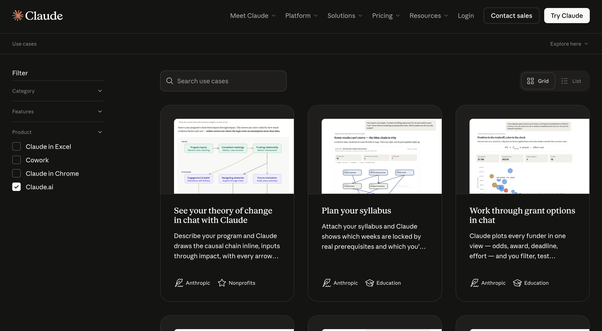
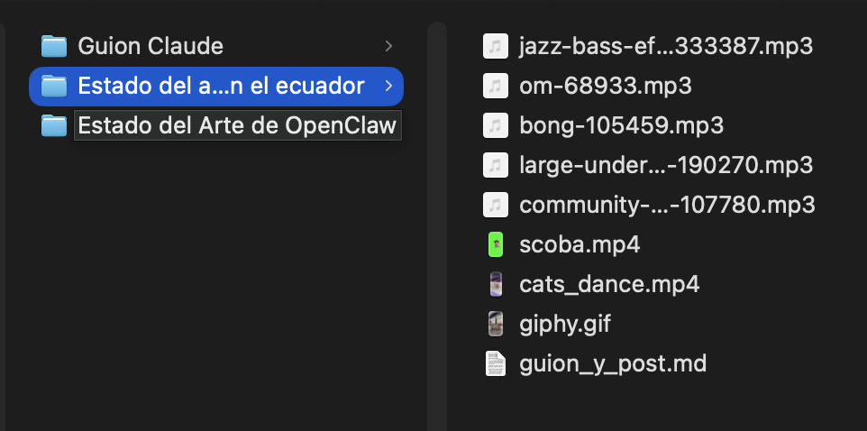
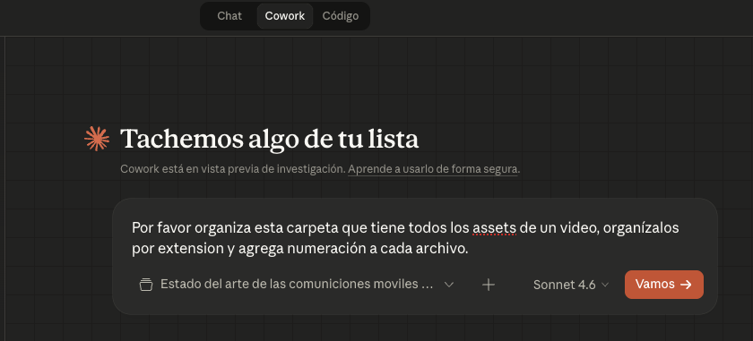
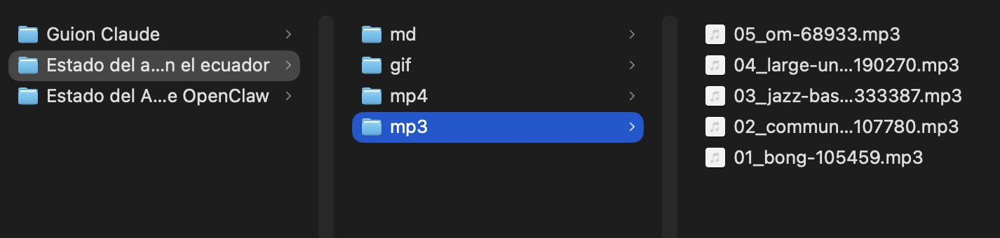

> **tl;dr** Claude para una exploración rápida, Claude Code para codificación y generación de subagentes, Claude Cowork para integrar herramientas de ofimática (hojas de cálculo y dashboards sencillos), y OpenClaw para generar asistentes autómatas que trabajen 24/7.

**Manifiesto de ética**
*Es importante mencionar que estas son herramientas de [LLM](https://arstechnica.com/ai/2024/12/why-ai-language-models-choke-on-too-much-text/), y se deben pensar siempre como una reconstrucción de colecciones de razonamientos aleatorios, o también pueden verse como una configuración de sistemas [estocásticos](https://dle.rae.es/estoc%C3%A1stico), las cuales pueden confluir en razonamientos muy bien estructurados o también pueden llegar a encontrarse con ruido que les llevará a respuestas erróneas y con alucinaciones (que no quedes como un alucín).*

*Por cuanto debes tener una responsabilidad perentoria en la revisión de cada una de sus afirmaciones, corroborando con fuentes con un rigor de verificación y validación (fuentes indexadas, estándares internacionales, etc).*

Es muy probable que te encuentres atosigado por la gran cantidad de información sobre herramientas de IA, y la "infoxicación" en redes sociales pueden llegar a confundirte y terminar gastando en una suscripción que nunca le darás uso. 

De entre toda esa nube de marketing de patito, nos podemos encontrar con joyas como Claude, que destaca por su filosofía, y [por oponerse al gobierno del señor naranja](https://arstechnica.com/tech-policy/2026/03/anthropic-sues-us-over-blacklisting-white-house-calls-firm-radical-left-woke/) en pro de la protección de la privacidad de sus clientes (valido solo para compradores americanos).

Pero que nos ofrece Claude, podemos simplificarlo así: 1. Herramientas para personas no técnicas y 2. Herramientas para personas técnicas. Pero dicha clasificación pierde interés y desaprovecha la potencialidad que tienen muchas de sus herramientas, por lo que yo la clasificaría de la siguiente manera (a inicios de abril del 2026):

## 1. Claude (a secas)
Todos lo conocen como el clásico chat donde tú preguntas y él responde, y en el cual alimentas un contexto y de acuerdo con él puedes obtener cierta información o formatos de salida.

### ¿Para qué usarlo?
Lo ideal sería para tareas específicas y bien definidas, una investigación rápida, una exploración de información, o diseños de mapas y esquemas iniciales, petición de cálculos rápidos y elasticidad de contextos.

Por ejemplo en la [propia documentación de Claude](https://claude.com/resources/use-cases) sugiere utilizarlo para: revisar y redlinear contratos legales, convertir investigaciones en presentaciones, planificar revisiones de literatura científica, analizar datos financieros bajo distintos escenarios, o simplemente como asistente personal para organizar ideas y tareas cotidianas.

### Claude Embedido
Estas son extensiones de Claude para un software en especifico como Excel o Chrome, por ejemplo [la extensión de Claude para Excel](https://claude.com/resources/use-cases/update-your-financial-model-after-earnings) puede ayudar a realizar un proceso de limpieza de datos, un análisis exploratorio o paneles (dashboard) de estadísticas completos.

Mientras que la extensión para Chrome ayuda a interactuar con el navegador directamente: puede leer tu calendario y prepararte para reuniones, limpiar correos promocionales del inbox, extraer métricas de dashboards de analítica sin exportar nada, comparar productos entre pestañas abiertas, organizar archivos en Google Drive, o registrar llamadas de ventas en tu CRM.

## 2. Claude Code
Usado en la línea de terminal para generar archivos, desarrollos y arquitecturas completas de software, es la manera más profesional que tiene Claude para usar sus modelos de LLM debido a que genera marcos de trabajo mucho más grandes, y el manejo de archivos más ordenado, la creación de subagentes para generar microcontextos y automatizar procesos mecánicos. 

### ¿Para qué usarlo?
Para generar software, bases de datos, arquitecturas, y código base.

## 3. Claude Cowork
Cowork es la misma arquitectura de Claude Code, pero empaquetada en una interfaz gráfica dentro de la app de escritorio de Claude. Útil para personas sin conocimiento técnico necesario.

Un caso rapido podria ser el ordenar los archivos de una carpeta, por ejemplo:

En el resultado final se observa que lo ordeno por extensión a cada uno de los archivo, y ademas los ha numerado.

### ¿Para qué usarlo?
Para tareas que cruzan varias herramientas y archivos a la vez, sin necesidad de escribir código. Por ejemplo:

- **Organización de archivos**: ordenar el escritorio o carpetas de documentos en subcarpetas con nombres claros.
- **Análisis financiero**: tomar exportaciones bancarias y archivos de contabilidad, cruzarlos y generar un reporte de conciliación con discrepancias marcadas.
- **Preparación para auditorías**: reorganizar contratos, políticas y registros dispersos en una colección lista para revisión regulatoria.
- **Briefings diarios**: consolidar información de Slack, Notion y dashboards de equipo en un resumen de prioridades del día.
- **Investigación de mercado**: a partir de una pregunta, Claude investiga, calcula y genera un PowerPoint, un Excel con metodología y un documento con citas.
- **Procesamiento de proveedores**: leer una carpeta de archivos de múltiples proveedores, agregarlos a un tracker, generar contratos y llenar formularios en el navegador en una sola sesión.

## 4. OpenClaw (Bonus)
Convierte un LLM en un agente autónomo que vive en tu computadora y se comunica contigo por Telegram, Discord o WhatsApp.

### ¿Para qué usarlo?
Para generar flujos de trabajo y ecosistemas entre varios agentes, uno investiga, otro escribe y otro revisa.

## Retroalimentación

| | **Claude (chat)** | **Claude Code** | **Cowork** | **OpenClaw** |
|---|---|---|---|---|
| **Interfaz** | Web / móvil / desktop | Terminal / IDE | Desktop app (pestaña Cowork) | Terminal + mensajería (Telegram, Discord, WhatsApp) |
| **Quién lo usa** | Todos | Desarrolladores | Profesionales no técnicos | Devs y power users |
| **Modo de trabajo** | Conversacional, un mensaje a la vez | Agéntico: lee tu codebase, edita archivos, ejecuta comandos | Agéntico: accede a tus carpetas, coordina sub-agentes | Agéntico autónomo: ejecuta tareas en tu sistema con skills |
| **Acceso a archivos** | Solo los que subes | Tu proyecto completo | Carpetas que autorices | Acceso al sistema (configurable) |

<iframe style="border:none" width="100%" height="450" src="https://whimsical.com/embed/CZ945pa5Wij8LAdpsnn7Qd"></iframe>

## Recursos de Aprendizaje
Ahora, existen herramientas gratuitas para aprender cualquiera de estas herramientas, y para ser honesto es preferible aprender en estas los propios cursos que emite Anthropic (empresa creadora de Claude), y puedes complementar ese conocimiento con habilidades compartidas en Reddit y con tu propia experimentación.

- [Anthropic Academy - Claude 101](https://anthropic.skilljar.com/claude-101)
- [Anthropic Academy - Framework & Foundations](https://anthropic.skilljar.com/ai-fluency-framework-foundations)
- [Anthropic Academy - Introducción a los subagentes](https://anthropic.skilljar.com/introduction-to-subagents)
- [Anthropic Academy - Introducción a Claude Cowork](https://anthropic.skilljar.com/introduction-to-claude-cowork)
- [Docs OpenClaw - Personal Assistant Setup](https://docs.openclaw.ai/start/openclaw)

## Referencias
- [Anthropic sues US over blacklisting; White House calls firm “radical left, woke”](https://arstechnica.com/tech-policy/2026/03/anthropic-sues-us-over-blacklisting-white-house-calls-firm-radical-left-woke/)
Posdata: Este artículo fue investigado y escrito por un humano, y haciendo uso de un subagente para corregir errores gramaticales y de semántica.
