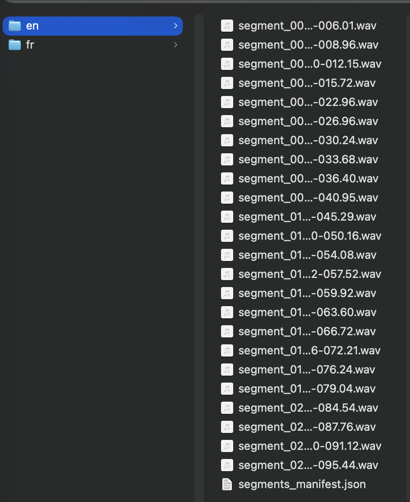
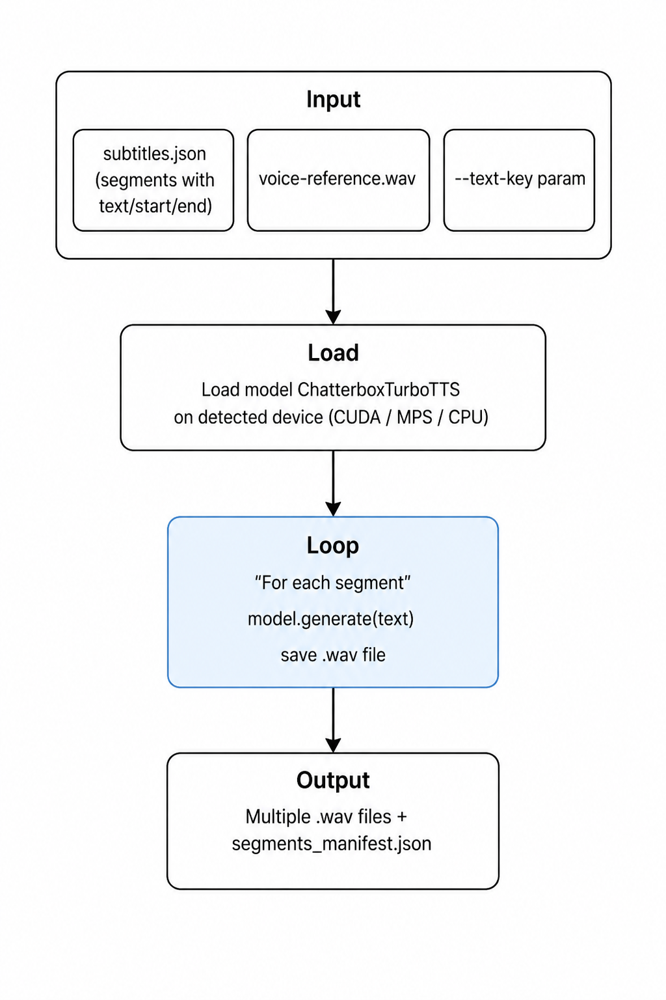

> **TL;DR:** Modificando Chatterbox para el uso de archivos `.srt`, se pueden doblar videos a una decena de idiomas sin pagar una suscripción.

## Índice

- [Uso de archivos `.srt` o `.json`](#uso-de-archivos-srt-o-json)
- [Lenguajes, acentos y particularidades de agrupación](#lenguajes-acentos-y-particularidades-de-agrupación)
- [Acentos](#acentos)
- [Unión de segmentos](#unión-de-segmentos)
- [Ideas de comercialización](#ideas-de-comercialización)
- [Conclusiones, reflexiones y uso ético de los clonadores de voz](#conclusiones-reflexiones-y-uso-ético-de-los-clonadores-de-voz)
- [Referencias](#referencias)

Seguramente en algún momento te has preguntado cómo Mr. Beast o [Johnny Harris](https://www.youtube.com/@johnnyharris) doblan sus videos a múltiples idiomas en YouTube. Mr. Beast, por ejemplo, contrata un actor de doblaje y un editor de audio, mientras que Johnny Harris utiliza un [clonador de voz](https://arxiv.org/html/2604.26136) basado en su timbre de voz para obtener un video homogeneizado en un idioma distinto. Luego lo agregan en una pista de audio de configuración en YouTube y logran expandir el alcance de sus videos a otros países.

<iframe width="100%" height="400" src="https://www.youtube.com/embed/8uoJNv9ufjM" title="Por qué estás tan aburrido" frameborder="0" allow="accelerometer; autoplay; clipboard-write; encrypted-media; gyroscope; picture-in-picture; web-share" referrerpolicy="strict-origin-when-cross-origin" allowfullscreen></iframe>

Los clonadores de voz por lo general utilizan arquitecturas de tipo [CosyVoice](https://arxiv.org/abs/2407.05407) (modelo Text-to-Speech) combinadas con recursos multimodales. Por ejemplo, utilizando un audio de referencia se puede tokenizar, realizar un análisis de espectro, usar un transformer, un flow matching y un vocoder combinado con el texto, y se obtendrá la clonación del audio.


Si bien podría seguir con el aspecto técnico de cómo se puede crear un clonador de voz muy superficialmente, la idea de este post es la aplicabilidad, por lo que realizaré un pequeño ensayo de pruebas y experimentación. Por ejemplo, utilizaré mi ambiente local para replicar una clonación de voz utilizando [**Chatterbox**](https://github.com/resemble-ai/chatterbox).

Instalaré las librerías indispensables en el ambiente local. Utilizaremos `pip`, ya que `chatterbox` está escrito en Python y en la documentación menciona previamente que debo tener instalado `torch`.

```bash
pip install chatterbox-tts
```

Clonaré el repositorio de `chatterbox`, en el que se menciona que se debe tener una versión de Python superior a la `3.11`.

```bash
git clone https://github.com/resemble-ai/chatterbox.git
cd chatterbox
pip install -e .
```

Para ya empezar a utilizarlo en su versión más moderna, llamada **Turbo**, se necesita crear un archivo que en este caso será llamado `clon-voice.py`. Dentro de la carpeta de `chatterbox`, aquí debes tener preparado un archivo de tu voz con un mínimo de 10 segundos llamado `voice-reference.wav`, y obtendrás de salida un archivo como `output-voice-en.wav`.

```python
import torchaudio as ta
import torch
from chatterbox.tts_turbo import ChatterboxTurboTTS

# Load the Turbo model
model = ChatterboxTurboTTS.from_pretrained(device="cuda")

# Generate with Paralinguistic Tags
text = "There's a guy who, in 2014, opened a laptop in a cafe in Thailand and built Nomad List."

# Generate audio (requires a reference clip for voice cloning)
wav = model.generate(text, audio_prompt_path="voice-reference.wav")

ta.save("output-voice-en.wav", wav, model.sr)
```
Puedes observar que en la variable `wav` llamo al modelo y uso como entrada el audio `voice-reference`, que seguramente será tokenizado para obtener la clonación de voz.

<div class="audio-spectrum" data-src="/assets/audio/voice-reference.wav" data-title="Voz de referencia">
  <div class="audio-spectrum__header">
    <p class="audio-spectrum__title">Voz de referencia</p>
    <span class="audio-spectrum__time"><span data-current-time>0:00</span> / <span data-duration>0:00</span></span>
  </div>
  <div class="audio-spectrum__spectrogram" data-spectrogram></div>
  <div class="audio-spectrum__waveform" data-waveform></div>
  <div class="audio-spectrum__controls">
    <button class="audio-spectrum__button" type="button" data-play>Reproducir</button>
  </div>
</div>

Para obtener los resultados ejecuto el archivo de python.

```bash
python3 clon-voice.py
```

Como puedes observar, en la variable `text` es donde se coloca el texto que quieres que se transforme en un audio, y en este ejemplo el audio dirá:

>There's a guy who, in 2014, opened a laptop in a cafe in Thailand and built "Nomad List."


<div class="audio-spectrum" data-src="/assets/audio/output-voice-en.wav" data-title="Voz clonada en inglés">
  <div class="audio-spectrum__header">
    <p class="audio-spectrum__title">Voz clonada en inglés</p>
    <span class="audio-spectrum__time"><span data-current-time>0:00</span> / <span data-duration>0:00</span></span>
  </div>
  <div class="audio-spectrum__spectrogram" data-spectrogram></div>
  <div class="audio-spectrum__waveform" data-waveform></div>
  <div class="audio-spectrum__controls">
    <button class="audio-spectrum__button" type="button" data-play>Reproducir</button>
  </div>
</div>

Pero usaremos como ejemplo también al francés y al japonés para observar su comportamiento.

>Il y a un type qui, en 2014, a ouvert son ordinateur portable dans un café en Thaïlande et a créé « Nomad List ».

<div class="audio-spectrum" data-src="/assets/audio/output-voice-fr.wav" data-title="Voz clonada en francés">
  <div class="audio-spectrum__header">
    <p class="audio-spectrum__title">Voz clonada en francés</p>
    <span class="audio-spectrum__time"><span data-current-time>0:00</span> / <span data-duration>0:00</span></span>
  </div>
  <div class="audio-spectrum__spectrogram" data-spectrogram></div>
  <div class="audio-spectrum__waveform" data-waveform></div>
  <div class="audio-spectrum__controls">
    <button class="audio-spectrum__button" type="button" data-play>Reproducir</button>
  </div>
</div>

>2014年、タイのカフェでノートパソコンを開き、「Nomad List」を作った男がいた。

<div class="audio-spectrum" data-src="/assets/audio/output-voice-jp.wav" data-title="Voz clonada en japonés">
  <div class="audio-spectrum__header">
    <p class="audio-spectrum__title">Voz clonada en japonés</p>
    <span class="audio-spectrum__time"><span data-current-time>0:00</span> / <span data-duration>0:00</span></span>
  </div>
  <div class="audio-spectrum__spectrogram" data-spectrogram></div>
  <div class="audio-spectrum__waveform" data-waveform></div>
  <div class="audio-spectrum__controls">
    <button class="audio-spectrum__button" type="button" data-play>Reproducir</button>
  </div>
</div>

Al reproducir las voces clonadas en otro idioma, se puede evidenciar la naturaleza del lenguaje sobre el tiempo de decir una oración. Tanto en español como en inglés duró 6 segundos decir la frase completa, mientras que para el francés y japonés tardó 10 s y 7 s respectivamente. Aunque con un actor de doblaje obviamente se pueden ajustar estos tiempos modificando el guion y utilizando sinónimos del idioma.

---

## Uso de archivos `.srt` o `.json`

Ahora, como sabrás, el audio de un video es muy espontáneo, es decir, contiene pausas, acentos y recursos del lenguaje que, al utilizar en el script anterior, producirían una voz demasiado artificial y podrían generar un desfase con las imágenes del video.

En este caso podemos ayudarnos con archivos `.srt` o `.json` (de subtítulos). En este formato se guarda el texto que se dice en un audio. Puedes usar las herramientas de tu editor de video favorito, ya sea CapCut, Final Cut, Adobe Premiere o DaVinci Resolve. En mi caso usaré una herramienta de licencia libre como [Autosubs](https://tom-moroney.com/auto-subs/) para obtener el archivo `.srt` de un [video propio](https://youtu.be/KQ3MnCnerw8?si=ccZGVUOIvOvlgRLK) publicado días atrás.

Este nos proveerá lo siguiente:
1. El guion del video
2. Los tiempos usados por el guion

Estos archivos también pueden o no traer el locutor del guion, y puedes generar una clonación de audio de varias voces para mejorar la calidad del audio. Extraeré una porción del guion del video que mencioné anteriormente.

```txt
1
00:00:00,040 --> 00:00:06,009
Hay un tipo que en 2014 se abrió una laptop en un café de taillandia y construyó "Nomad Liz".

2
00:00:06,280 --> 00:00:08,960
Sin equipos, sin inversores, sin oficina,

3
00:00:09,000 --> 00:00:12,150
y hoy factura casi 3 millones de dólares al año.
```

Si observas el `.srt`, se puede rescatar lo siguiente:

1. La segmentación enumerada de las oraciones del guion
2. Las marcas de tiempo de inicio y fin
3. La oración del guion
4. Y en algunas ocasiones, se puede mostrar el locutor con un número de identificación

Con esta información podemos crear un script que mantenga una fase de acuerdo con los tiempos establecidos y, de esta manera, fasar el audio de la pista del doblaje. Pero hay que recordar que lo que se quiere hacer es un doblaje a otro idioma con el mismo timbre de voz. Para este caso de español a inglés, se debe traducir el guion; podemos usar Claude Code, Codex, Gemini o cualquier otro LLM para este propósito:

```txt
1
00:00:00,040 --> 00:00:06,009
There's a guy who, in 2014, opened a laptop in a cafe in Thailand and built "Nomad List."

2
00:00:06,280 --> 00:00:08,960
No team, no investors, no office,

3
00:00:09,000 --> 00:00:12,150
and today it brings in almost 3 million dollars a year.
```


## Lenguajes, acentos y particularidades de agrupación
Por la propia estructura y formación de cada idioma, un lenguaje se puede tardar más o menos tiempo en decir una misma frase que otro lenguaje, por lo que dependerá de las ideas que se transmiten en un video y de la "calibración" del guion para encajar a la perfección. 

Para lograr fasar el doblaje con las imágenes deberemos crear un script de Python que realice lo siguiente:

1. Leer el archivo `.json` o `.srt` para formar rangos de tiempos con los segmentos de las palabras
2. Generar la clonación de voz de cada segmento y obtener el archivo `.wav`

Por lo que por cada segmento podremos obtener un número X de archivos `.wav` que podremos utilizar en un editor de video para colocar de acuerdo con el locutor.




### Acentos 
Chatterbox clonará la voz con tu mismo timbre y acento de voz. Por ejemplo, para el caso de que queramos doblar un audio del español al inglés utilizando mi voz, al clonar la voz con un texto en inglés el resultado será un audio en inglés con acento latino (que es mi acento nativo). ¿Cómo arreglar esto? Chatterbox trae un parámetro de pesos, denominado [cfg_weight](https://chatterboxtts.com/docs), que tomará un valor de 0 a 1 para dar más peso a un estilo de habla, donde 0 le dará el estilo del inglés neutral (con el cual fue entrenado) y 1 le dará más peso al estilo de la voz de referencia.

Ahora, como sabes, la diversidad de acentos y dialectos de los lenguajes dependerá de la región del hablante, ya que el acento del inglés neoyorquino será diferente del acento de alguien que vive en San Francisco, o el acento del francés de París será diferente al francés de Lyon, y lo mismo para las demás lenguas. Ahora, ¿cómo Chatterbox maneja los acentos? En sí, Chatterbox no tiene soporte para tratar con los diversos acentos de las lenguas, ya que el conjunto de datos de entrenamiento se realizó con un único acento, por ejemplo para un inglés neutral, para un francés neutral, etc. Y no, ElevenLabs tampoco da soporte para elegir un acento en otro idioma.

**¿Por qué no dan soporte?** Porque el objetivo de estas herramientas fue clonar la voz de referencia, no hacer un doblaje de guiones. Puedes hacer una lectura rápida sobre este tema en este artículo que habla sobre la [preservación de voz](https://arxiv.org/pdf/2405.13162).

Aquí se abren las puertas y la oportunidad de diseñar modelos de clonación de voz que puedan replicar acentos locales y dialectos regionales de otras lenguas. Obviamente sería un trabajo de investigación, tokenización, análisis de espectro, transformación, codificación, entrenamiento y despliegue del modelo. 

Siguiendo el enfoque del post, con ello se puede crear una arquitectura para adaptar el clonador de voz a un `doblador de voz`, en la cual se propone la siguiente:



## Unión de segmentos

El resultado final lo puedes evidenciar en el siguiente video cargado en YouTube. Utiliza la opción de "Cambiar de pista". Si observas, mantiene el timbre de voz, un acento en inglés casi neutral y, en la mayoría de los segmentos, resguarda y respeta las marcas de tiempo de inicio y final. En las que no logra obtenerla, se mantiene un silencio. Curiosamente, me he fijado en dichos silencios que existen en los videos de Johnny Harris, con lo que infiero que está utilizando alguna herramienta de clonación de voz para doblar sus videos.


<iframe
  width="100%"
  style="aspect-ratio: 9/16; max-width: 400px; display: block; margin: 0 auto;"
  src="https://www.youtube.com/embed/KQ3MnCnerw8"
  title="OpenClaw - Estado del Arte"
  frameborder="0"
  allow="accelerometer; autoplay; clipboard-write; encrypted-media; gyroscope; picture-in-picture"
  allowfullscreen>
</iframe>


## Ideas de comercialización

Como observas, el modelo que acabamos de realizar ya es un producto mínimamente viable (MVP) en potencia. Con ciertos ajustes y despliegue se puede generar una _lista de espera_ con una prueba gratuita para saber cuánto la gente está dispuesta a pagar para doblar sus videos a otros idiomas utilizando una IA de clonación de voz. Obviamente elegí Chatterbox debido a que tiene una licencia de uso, modificación y comercialización.

Aunque, para ser sinceros, el nicho de mercado en el cual puede funcionar esto es dentro de los editores de video y creadores de contenido. Un producto final puede ser un plugin para software de edición de video como DaVinci Resolve, Adobe Premiere y Final Cut Pro, donde para un audio de cualquier pista se realice 1. la transcripción de audio a texto, 2. la traducción al idioma a doblar y, por último, 3. la clonación de voz para el doblaje. También puede funcionar como una aplicación web de doblaje de audios, que en sí es el modelo de negocio de [ElevenLabs](https://elevenlabs.io/).

El valor agregado puede ser la implementación de acentos y dialectos de ciertas regiones, pero el esfuerzo viene de entrenar dichos modelos, el uso de guiones y tal vez la adaptación a la jerga de cierta localidad.

## Conclusiones, reflexiones y uso ético de los clonadores de voz

La aplicación que le hemos dado en este post es con el propósito de expandir el alcance de videos a una audiencia de otros idiomas, realizándolo desde una herramienta open source. Y si bien el resultado no alcanza al que un actor de doblaje te podría dar, es aceptable y la mayor ventaja es que se puede realizar en una docena de lenguas.

Sin embargo, cabe mencionar el uso ético de los clonadores, que como **builders** deben ser usados con la mayor responsabilidad y buen juicio, y no para vulnerar o perjudicar la reputación de alguien.

Dicho lo último como un pequeño recordatorio, termino el post mencionando que seguiré una serie de posts enfocados en el análisis frecuencial de ondas sonoras, detección de clonación de voz, generación de música con IA y demás aplicaciones que se encuentren en tendencia.


## Referencias

- Abebe, A. G., & Moslem, Y. (2026). *One voice, many tongues: Cross-lingual voice cloning for scientific speech*. arXiv. https://arxiv.org/html/2604.26136
- Du, Z., Chen, Q., Zhang, S., Hu, K., Lu, H., Yang, Y., Hu, H., Zheng, S., Gu, Y., Ma, Z., Gao, Z., & Yan, Z. (2024). *CosyVoice: A scalable multilingual zero-shot text-to-speech synthesizer based on supervised semantic tokens*. arXiv. https://arxiv.org/abs/2407.05407
- ElevenLabs. (s. f.). *ElevenLabs*. Recuperado el 12 de mayo de 2026, de https://elevenlabs.io/
- Harris, J. (s. f.). *Johnny Harris* [Canal de YouTube]. YouTube. Recuperado el 12 de mayo de 2026, de https://www.youtube.com/@johnnyharris
- Moroney, T. (s. f.). *AutoSubs*. Recuperado el 12 de mayo de 2026, de https://tom-moroney.com/auto-subs/
- Resemble AI. (2025). *Chatterbox TTS* [Repositorio de GitHub]. GitHub. https://github.com/resemble-ai/chatterbox
- Resemble AI. (s. f.). *Chatterbox: Open source text-to-speech*. Recuperado el 12 de mayo de 2026, de https://www.resemble.ai/learn/models/chatterbox
- Castillo, D. (2026). *OpenClaw - Estado del Arte* [Video]. YouTube. https://youtu.be/KQ3MnCnerw8
