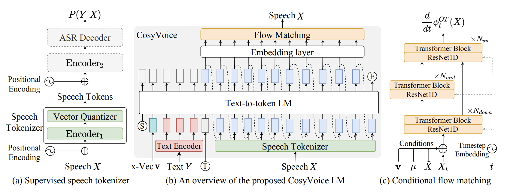

>tl;dr 

Seguramente en algun momento te has preguntado como Mr. Beast o [Johnny Harris](https://www.youtube.com/@johnnyharris) doblan sus videos a multiples idiomas en Youtube, Mr Beast por ejemplo contrata un actor de doblaje y un editor de audio, mientras que Johnny Harris utiliza  un [clonador de voz](https://arxiv.org/html/2604.26136) basado en su timbre de voz para obtener un video homogeneizado en un idioma distinto, luego lo agregan en una pista de audio de configuración en Youtube y logran expandir el alcance de sus videos a otros paises.

<iframe width="100%" height="400" src="https://www.youtube.com/embed/8uoJNv9ufjM" title="Por qué estás tan aburrido" frameborder="0" allow="accelerometer; autoplay; clipboard-write; encrypted-media; gyroscope; picture-in-picture; web-share" referrerpolicy="strict-origin-when-cross-origin" allowfullscreen></iframe>

Los clonadores de voz por lo general utilizan arquitecturas de tipo [CosyVoice](https://arxiv.org/abs/2407.05407) (Modelo Texto-to-Speech) combinando con recursos multimodales, por ejemplo utilizando un audio de referencia se puede tokenizar, realizar un analisis de espectro, usar un transformer, un flow matching y un vocode combinado con el texto y se obtendra la clonación del audio.



## Mesa de trabajo de clonación de voz

Si bien podria seguir con el aspecto tecnico de como se puede crear un clonador de voz muy superficialmente, la idea de este post es de la aplicabilidad, para ello se puede generar los siguientes pasos:

**PASO 1:** Armar un espacio de trabajo, puede ser tu computador o una instancia virtual como la de Google Colab.

**PASO 2:** Instalar las librerias indispensables en el ambiente local, utilizaremps `pip` para este cometido, ya que `chatterbox` esta escrito en python. Abrimos la terminal respectica y aplicaremos el siguiente CLI:

```bash
pip install chatterbox-tts
```

**PASO 3:** Clonaremos el repositorio de `chatterbox`, tener en cuenta que utilizara la versión de `python 3.11`.

```bash
# conda create -yn chatterbox python=3.11
# conda activate chatterbox

git clone https://github.com/resemble-ai/chatterbox.git
cd chatterbox
pip install -e .
```

**PASO 4:** Para ya empezar a utilizarlo y en su versión mas moderna llamada **Turbo**, se necesita crear un archivo que en este caso sera llamado`clon-voice.py` y dentro de la carperta de `chatterbox`, aqui debes tener preparado un archivo de tu voz con un minimo de 10 segundos llamado `voice-reference.wav`, y un obtendrás de salida un archivo `test-turbo.wav` con clonada.

```python
import torchaudio as ta
import torch
from chatterbox.tts_turbo import ChatterboxTurboTTS

# Load the Turbo model
model = ChatterboxTurboTTS.from_pretrained(device="cuda")

# Generate with Paralinguistic Tags
text = "Shayne Coplan was 22 years old when he founded Polymarket alone in 2020. Programming from the bathroom of his apartment in New York. Without a penny. Selling his things to pay the rent."

# Generate audio (requires a reference clip for voice cloning)
wav = model.generate(text, audio_prompt_path="voice-reference.wav")

ta.save("output-voice.wav", wav, model.sr)
```

**Voz de referencia:**

<audio controls preload="metadata" style="width: 100%;">
    <source src="/assets/audio/voice-reference.wav" type="audio/mpeg" />
    Tu navegador no soporta el reproductor de audio.
  </audio>


**PASO 5:** Ejecutar el archivo de python.

```bash
python3 clon-voice.py
```

Como puedes observar en la variable `text` es donde se coloca el texto que quieres que se transforme en un audio, y en este ejemplo el audio dira:

>Shayne Coplan was 22 years old when he founded Polymarket alone in 2020. Programming from the bathroom of his apartment in New York. Without a penny. Selling his things to pay the rent.


**Voz Clonada en Ingles**

<audio controls preload="metadata" style="width: 100%;">
    <source src="/assets/audio/output-voice.wav" type="audio/mpeg" />
    Tu navegador no soporta el reproductor de audio.
  </audio>

---

## Uso de archivos `.str` o `.json`

Ahora como sabras el audio de un video es muy espontaneo, es decir contiene pausas, acentos, y recursos del lenguaje que al utilizar en el script anterior se obtendria una voz demasiada artificial y que exista un desfase con las imagenes del video.

En este caso podemos hacernos de la ayuda de los arhcivos `.str` o `.json` (de subtitulos), en este formato se guardara el texto que se dice en un audio, puedes usar las herramientas de tu editor de video favorito ya sea capcut, final cut, adobe premiere o davinci resolve. En mi caso usare una herramienta de licencia libre como lo es [Autosubs](https://tom-moroney.com/auto-subs/) para obtener el archivo `.str` pero para tener mayor precisión y evitar el desfase, usare el archivo `.json`.

Este nos proveera los siguiente:
1. El guión del video
2. Los tiempos usados por el guión

Estos archivos tambien pueden traer el locutor del guión, y puedes generar una clonación de audio de varias voces para mejorar la calidad del audio. Por ejemplo usare un video propio ya publicado anteriormente, y veremos a detalle que información logro extraer de una porción:

```json
{
  "createdAt": "2026-05-03T16:55:52.540Z",
  "segments": [
    {
      "id": "0",
      "start": 0.04,
      "end": 6.01,
      "text": "Hay un tipo que en 2014 se abrió una laptop en un café de taillandia y construyó \"Nomad List\".",
      "words": [
        {
          "word": "Hay",
          "start": 0.04,
          "end": 0.2,
          "probability": 0.8284269,
          "line_number": 0
        },
...
```

Si observas el `.json`, se puede rescatar lo siguiente:

1. La fecha y hora de creación.
2. La segmentación por frases.
3. Un array de las palabras utilizadas y los tiempos de muestra.
4. La probabilidad de posición temporal.
5. El locutor `line_number`, como solo es 1 (para este caso) aparece en 0.

Con esta información podemos crear un script que mantenga una fase de acuerdo a los tiempos establecidos, y de esta manera fasas el audio de la pista del doblaje. Pero antes de pasar a generar el script, lo que desearia es que esta transcripcion realizada en español sea en ingles, para este caso podemos usar Claude Code, Codex, Gemini o cualquier LLM, obteniendo un guion como el siguiente:

```json
{
  "createdAt": "2026-05-03T16:55:52.540Z",
  "segments": [
    {
      "id": "0",
      "start": 0.04,
      "end": 6.01,
      "text": "There a guy who in 2014 opened a laptop in a cafe from Thailand and built \"Nomad Liz\".",
      "words": [
        {
          "word": "There",
          "start": 0.04,
          "end": 0.2,
          "probability": 0.8284269,
          "line_number": 0
        },
...
```

## Fase del doblaje

Para lograr dejar en fase tanto el doblaje como las imagenes deberemos crear un script de python que realice lo siguiente:

1. 


## Ideas de comercialización

Como observas el modelo que acabamos de realizar ya es un producto miniamente viable (MVP) en potencia, con ciertos ajustos y despliegue se puede generar una _lista de espera_ con una prueba gratuita para saber cuanto la gente esta dispuesta a pagar para doblar sus videos a otros idiomas utilizando una IA de clonación de voz. 

Aunque para ser sinceros el nicho de mercado en el cuál puede funcionar esto es dentro de los editores de video y creadores de contenido. Un producto final puede ser un plugin para software de edición de video y/o una web de doblaje de audio a otros idiomas como lo hace [elevenlabs](https://elevenlabs.io/).

