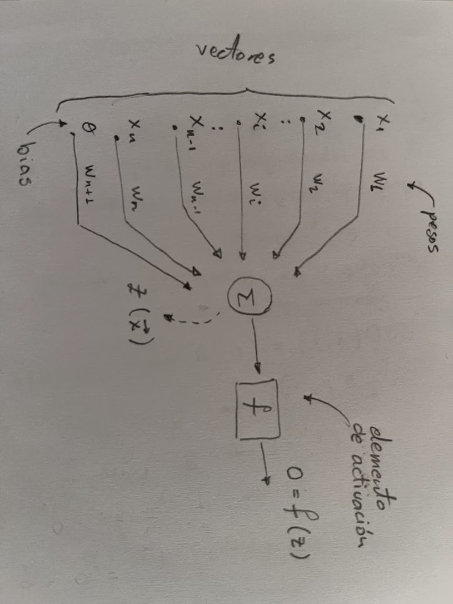
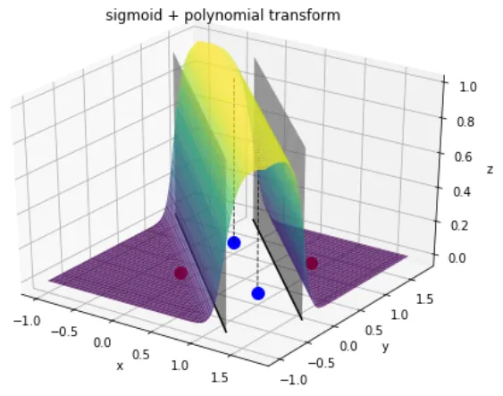

import MSEVisualizer from './MSEVisualizer.jsx'


Como habrás notado en la semana pasada [OpenAI lanzó Images 2.0](https://openai.com/es-ES/index/introducing-chatgpt-images-2-0/), un modelo que increíblemente ejecuta instrucciones casi al detalle al momento de generar imágenes. Y para ser honesto, los lanzamientos constantes de modelos de frontera, han hecho que para mí sea casi imposible seguirles el paso.

Entonces preferí regresar a las bases, fui a desempolvar mis apuntes y textos de redes neuronales de mi universidad de pregrado, y me pregunté si los creadores de las [frutas infieles](https://www.reddit.com/r/PreguntasReddit/comments/1sh5pkc/aquien_mas_le_gustan_las_frutinovelas/) estarán conscientes que existe algo llamado el perceptrón, que es la base de la generación de videos, guiones y audios que a muchas personas les gusta consumir, o si los _Ingenieros de IA de Instagram_ sabrán de la existencia de esta unidad de cómputo tan simple (bueno, no tan simple), pero tan poderosa.

Por allá en la década de los 50's, Frank Rosenblatt propuso una idea algo interesante de [transpolar el mundo biológico al mundo de la computación](https://www.newyorker.com/magazine/1958/12/06/rival-2), y su primera exposición fue con el reporte del laboratorio aeronáutico de Cornell llamado ["The Perceptron a perceiving and recognizing automaton"](https://bpb-us-e2.wpmucdn.com/websites.umass.edu/dist/a/27637/files/2016/03/rosenblatt-1957.pdf) donde se esboza al "fotoperceptrón" como un sistema que aprende mediante refuerzo estadístico; un año más tarde propondría la organización de un perceptrón en su obra más popular.



En resumen, un perceptrón puede definirse como la discriminación de una suma promediada, y dicha discriminación es realizada por una "función de activación":

$$
y = f(\sum_{i=1}^{n} w_i x_i + \theta w_{n+1})
$$

Donde:

- $x_1, x_2, \dots, x_n$ son las **entradas** (features).
- $w_1, w_2, \dots, w_n$ son los **pesos** (cuánto importa cada entrada).
- $b = \theta w_{n+1}$ es el **sesgo** (bias), un offset que desplaza la decisión.
- $f$ es la función de activación, en este caso un escalón unitario.

Puedo mencionar que existe mucha literatura acerca del análisis del perceptrón, y como amante del OCW MIT, me gusta la [definición de este recurso](https://ocw.mit.edu/courses/hst-951j-medical-decision-support-fall-2005/resources/hst951_9/), rápida y concisa.


Y hay que tener en consideración la función de activación $f(z)$, ya que me brindará las clases del perceptrón, que comúnmente para temas didácticos se usa el escalón unitario, obteniendo así dos clases $c_1$ y $c_2$:

$$
f(z) = \begin{cases} 1 & \text{si } z > 0 ; Clase \ c_1 \\ 0 & \text{si } z \leq 0; Clase \ c_2 \end{cases}
$$

El objetivo del método de aprendizaje consiste en obtener los pesos $w_i$ para discriminar las dos clases $c_1$ y $c_2$. Ahora... ¿cómo se hallan dichos pesos? Es ahí donde se encuentra la experimentación durante todos estos 60 años, suficiente tiempo para que el _science's peak_ sea crear un personaje llamado "Tralalero Tralala". Pero para no desviarme del tema, el método clásico es usar el generado por _Widrow Hoff_, denominado la _regla delta de mínimos cuadrados_ (un caso particular del descenso del gradiente).

¿Recuerdas que había dicho que _Frank Rosenblatt_ mencionaba que el método de aprendizaje era mediante refuerzo estadístico? Pues aquí es donde entra el concepto estadístico.

Frank propone que el [error cuadrático medio](https://ocw.mit.edu/courses/15-075j-statistical-thinking-and-data-analysis-fall-2011/resources/mit15_075jf11_chpt06b/) (MSE) $E(w)$ debe converger en 0 o encontrando el mínimo posible (de acuerdo a una tasa de aprendizaje denominada $\eta$).

$$
E(w) = \frac{1}{N} \sum_{i=1}^{N}(y_i - \hat{y_i})^2
$$

Por lo que se debe implementar una regla de actualización (también llamada adaptación de pesos) para minimizar el error cuadrático en una neurona lineal, y dicha regla es la siguiente:

$$
w_i \leftarrow w_i + \eta (y_i - \hat{y_i}) x_i
$$

En resumen se puede sintetizar el proceso en un algoritmo:

**PASO 1:** Inicializar los pesos $w_i$ y el sesgo $b$ con valores aleatorios.

**PASO 2:** Para cada ejemplo de entrenamiento $(x, y_{real})$:
- Calcular la salida del perceptrón $\hat{y} = f(\sum w_i x_i + b)$.
- Actualizar los pesos y el sesgo usando la regla de actualización.

**PASO 3:** Repetir el proceso hasta que el error cuadrático medio $E(w)$ sea suficientemente pequeño o se alcance un número máximo de iteraciones.

**Nota:** El perceptrón solo puede aprender a clasificar datos que sean linealmente separables. Si los datos no son linealmente separables, el algoritmo no convergerá.

Para hacerlo interactivo dejaré un visualizador del error cuadrático medio, para que puedas experimentar con los pesos y ver cómo el error converge a medida que el perceptrón aprende a clasificar correctamente.
<MSEVisualizer client:load />


Ahora usaremos **RUST** para poder generar un perceptrón; tomaré un ejercicio de perceptrones del texto "Visión por computador" de Gonzalo Pajares, para implementarlo.

**Ejercicio:** Suponer una biclase dada a continuación con un $\eta=1/2$, obtener los pesos de conexión y la función de decisión.

Pesos iniciales $w_1 = w_2 = w_3 = 0$
Vector patrón aumentados:
| $x_1$ | $x_2$ | $x_3$ | $f(z)=y$ |
| ----- | ----- | ----- | ----- |
| 0     | 0     | 1     | 1     |
| 0     | 1     | 1     | 1     |
| 1     | 0     | 1     | -1     |
| 1     | 1     | 1     | -1     |

**Solución:**

Al ver qué salida se espera, se puede intuir que la función de decisión es algo así como:
$$f(z) = \begin{cases} 1 & \text{si } z > 0 \\ -1 & \text{si } z \leq 0 \end{cases}$$

Graficamos las entradas y salidas para visualizar la separación de clases:


Por lo tanto, se puede usar la regla de actualización para cada patrón de entrenamiento:

1. Para el primer patrón $(0, 0, 1)$ con salida esperada $1$:
   - $z = w_1*0 + w_2*0 + w_3*1 = 0$
   - $z = 0*0 + 0*0 + 0*1 = 0$
   - Usando la función de activación $f(z)$, se obtiene $\hat{y} = f(0) = -1$ (incorrecto porque debe ser 1)
   - Calculando el error $y - \hat{y} = 1 - (-1) = 2$
   - Actualización de pesos:
        - $w_1 \leftarrow w_1 + \eta (y - \hat{y}) x_1 = 0 + 0.5 * 2 * 0 = 0$
        - $w_2 \leftarrow w_2 + \eta (y - \hat{y}) x_2 = 0 + 0.5 * 2 * 0 = 0$
        - $w_3 \leftarrow w_3 + \eta (y - \hat{y}) x_3 = 0 + 0.5 * 2 * 1 = 1$

2. Para el segundo patrón $(0, 1, 1)$ con salida esperada $1$:
   - $z = w_1*0 + w_2*1 + w_3*1 = 1$
   - $z = 0*0 + 0*1 + 1*1 = 1$
   - $\hat{y} = f(1) = 1$ (correcto)
   - No hay error, por lo que no se actualizan los pesos.

3. Para el tercer patrón $(1, 0, 1)$ con salida esperada $-1$:
   - $z = w_1*1 + w_2*0 + w_3*1 = 1$
    - $z = 0*1 + 0*0 + 1*1 = 1$
    - $\hat{y} = f(1) = 1$ (incorrecto porque debe ser -1)
    - Calculando el error $y - \hat{y} = -1 - 1 = -2$
    - Actualización de pesos:
        - $w_1 \leftarrow w_1 + \eta (y - \hat{y}) x_1 = 0 + 0.5 * (-2) * 1 = -1$
        - $w_2 \leftarrow w_2 + \eta (y - \hat{y}) x_2 = 0 + 0.5 * (-2) * 0 = 0$
        - $w_3 \leftarrow w_3 + \eta (y - \hat{y}) x_3 = 1 + 0.5 * (-2) * 1 = 0$
4. Para el cuarto patrón $(1, 1, 1)$ con salida esperada $-1$:
   - $z = w_1*1 + w_2*1 + w_3*1 = -1$
   - $z = -1*1 + 0*1 + 0*1 = -1$
   - $\hat{y} = f(-1) = -1$ (correcto)
   - No hay error, por lo que no se actualizan los pesos.

Por lo tanto los pesos finales son $w_1 = -1$, $w_2 = 0$, $w_3 = 0$ y la función de decisión es:
$$f(z) = \begin{cases} 1 & \text{si } z > 0 \\ -1 & \text{si } z \leq 0 \end{cases}$$

Ahora, llevándolo a Rust, se puede implementar el perceptrón de la siguiente manera:
```rust
fn perceptron(x: &[f64], w: &[f64], b: f64) -> u8 {
    let z: f64 = x.iter().zip(w.iter()).map(|(xi, wi)| xi * wi).sum::<f64>() + b;
    if z > 0.0 { 1 } else { 0 }
}

fn main() {
    let mut w = [0.0, 0.0, 0.0];
    let mut b = 0.0;
    let alpha = 0.5;

    let training_data = [
        ([0.0, 0.0, 1.0], 1),
        ([0.0, 1.0, 1.0], 1),
        ([1.0, 0.0, 1.0], -1),
        ([1.0, 1.0, 1.0], -1),
    ];

    for (x, y) in &training_data {
        let y_hat = perceptron(x, &w, b);
        let error = *y as f64 - y_hat as f64;
        for i in 0..w.len() {
            w[i] += alpha * error * x[i];
        }
        b += alpha * error;
    }

    println!("Pesos finales: {:?}", w);
    println!("Sesgo final: {}", b);
}
```

Si graficamos los casos, sabiendo que $$x_3$$ es el bias (y este por lo general no se representa en la gráfica), se puede observar que las entradas son linealmente separables, y por lo tanto el perceptrón converge a una solución que clasifica correctamente los patrones de entrenamiento.


## El gran problema: el XOR

En 1969, Marvin Minsky y Seymour Papert publicaron un libro titulado [*Perceptrons*](https://rodsmith.nz/wp-content/uploads/Minsky-and-Papert-Perceptrons.pdf) donde demostraron que un perceptrón no puede resolver el problema XOR. Algo curioso, ya que en electrónica digital el XOR es ni más ni menos que una de las compuertas más importantes, y es la base de la aritmética binaria.

| $x_1$ | $x_2$ | XOR |
| ----- | ----- | --- |
| 0     | 0     | 0   |
| 0     | 1     | 1   |
| 1     | 0     | 1   |
| 1     | 1     | 0   |

¿Por qué? Porque XOR no es linealmente separable, y por eso grafiqué el caso anterior, donde si te das cuenta, la representación gráfica del perceptrón es una línea recta, y para el caso de XOR, no existe una sola línea recta que separe los casos esperados $c_1$ y $c_2$.

Pero de forma intuitiva dirías: pues grafiquemos dos líneas rectas, y con eso se resuelve el problema. Te podría decir que sí, pero no, [**la idea en general es colocar en cascada los perceptrones**](https://medium.com/@lucaspereira0612/solving-xor-with-a-single-perceptron-34539f395182) y utilizar una función de activación diferenciable.

Por ende, se empezó a utilizar funciones de activación no lineales, como la sigmoide, tanh o ReLU, que permiten a las redes neuronales aprender representaciones más complejas y resolver problemas no linealmente separables como XOR.

| Función  | Fórmula                                | Cuándo usar                             |
| -------- | -------------------------------------- | --------------------------------------- |
| Sigmoide | $\sigma(z) = \frac{1}{1 + e^{-z}}$     | Probabilidades binarias (salida)        |
| Tanh     | $\tanh(z)$                             | Capas ocultas (cayó en desuso)          |
| ReLU     | $\max(0, z)$                           | Estándar en capas ocultas hoy           |
| Softmax  | $\frac{e^{z_i}}{\sum_j e^{z_j}}$       | Clasificación multiclase (salida)       |




ReLU domina porque es barata de calcular y mitiga el problema del *vanishing gradient*.

## Backpropagation: cómo aprenden las redes profundas

El truco que destrabó todo en los 80 (Rumelhart, Hinton y Williams, 1986) fue **backpropagation**: una forma eficiente de calcular cómo cada peso de la red contribuye al error final, usando la **regla de la cadena** del cálculo diferencial.

A grandes rasgos:

1. **Forward pass**: la entrada atraviesa la red y produce una predicción.
2. Se calcula el **error** (función de pérdida) entre predicción y valor real.
3. **Backward pass**: el error se propaga hacia atrás, capa por capa, repartiendo "culpa" entre los pesos.
4. Cada peso se ajusta con **gradient descent**:

$$
w_i \leftarrow w_i - \eta \frac{\partial L}{\partial w_i}
$$

Repite millones de veces, y la red converge.

> Esta es la magia: el mismo algoritmo que enseña a un MLP a clasificar dígitos es el que entrena a GPT-4. Solo cambian la escala, los datos y la arquitectura.

## De perceptrones a transformers

Las redes modernas son perceptrones con esteroides arquitectónicos:

- **CNN (Convolutional Neural Networks)**: perceptrones que comparten pesos para detectar patrones locales en imágenes.
- **RNN / LSTM**: perceptrones con memoria, para secuencias.
- **Transformers**: perceptrones combinados con un mecanismo de atención que pondera dinámicamente qué partes de la entrada importan más. Esta es la base de los LLMs.

A pesar de todas estas evoluciones, **dentro de cada bloque de un transformer hay perceptrones haciendo su trabajo de siempre**: multiplicar entradas por pesos, sumar un sesgo, aplicar una activación.

## Conclusiones y Reflexiones finales

Se puede decir que el perceptrón es el ladrillo en esta construcción gigante de la inteligencia artificial. Sin él, no tendríamos redes neuronales profundas, ni transformers, ni LLMs. Es el concepto fundamental que nos permite entender cómo las máquinas pueden aprender a partir de datos.

Esta es una primera parte de una serie de artículos donde compartiré la exploración de las redes neuronales aplicadas a la visión por computador, además estare compartiendo la creación de aplicaciones que se centrarán en negocios digitales.

He visto que el enfoque se ha centrado en consumir servicios de tipo MCPs o APIs de Claude, Gemini o ChatGPT, pero la creación de modelos propios es algo que se ha dejado de lado, mucho hype y poco sentido común para estar gastando no solo infraestructura sino en tokens.

Si quieres aprender conmigo a crear tus propios modelos, o entender a fondo cómo funcionan, te invito a seguir esta serie de artículos donde desglosaremos cada componente de las redes neuronales, desde el perceptrón hasta los transformers, y veremos cómo aplicarlos en casos reales.

## Referencias

- Rosenblatt, F. (1957). [The Perceptron: A Perceiving and Recognizing Automaton](https://bpb-us-e2.wpmucdn.com/websites.umass.edu/dist/a/27637/files/2016/03/rosenblatt-1957.pdf). Cornell Aeronautical Laboratory, Report No. 85-460-1.
- Rosenblatt, F. (1958). [The Perceptron: A Probabilistic Model for Information Storage and Organization in the Brain](https://psycnet.apa.org/record/1959-09865-001). Psychological Review.
- Minsky, M. & Papert, S. (1969). [*Perceptrons: An Introduction to Computational Geometry*](https://rodsmith.nz/wp-content/uploads/Minsky-and-Papert-Perceptrons.pdf). MIT Press.
- Rumelhart, D., Hinton, G. & Williams, R. (1986). [Learning representations by back-propagating errors](https://www.nature.com/articles/323533a0). Nature.
- Goodfellow, I., Bengio, Y. & Courville, A. (2016). [Deep Learning](https://www.deeplearningbook.org/). MIT Press.
- Pajares, G. & de la Cruz, J. M. *Visión por Computador: Imágenes digitales y aplicaciones*. Ra-Ma.
- Nielsen, M. [Neural Networks and Deep Learning](http://neuralnetworksanddeeplearning.com/) — libro online gratuito.
- 3Blue1Brown. [Serie sobre redes neuronales](https://www.3blue1brown.com/topics/neural-networks) — explicación visual recomendada.
- MIT OpenCourseWare. [HST.951J — Medical Decision Support: The Perceptron](https://ocw.mit.edu/courses/hst-951j-medical-decision-support-fall-2005/resources/hst951_9/).
- MIT OpenCourseWare. [15.075J — Statistical Thinking and Data Analysis: Mean Squared Error](https://ocw.mit.edu/courses/15-075j-statistical-thinking-and-data-analysis-fall-2011/resources/mit15_075jf11_chpt06b/).
- Pereira, L. (2021). [Solving XOR with a Single Perceptron](https://medium.com/@lucaspereira0612/solving-xor-with-a-single-perceptron-34539f395182). Medium.
- The New Yorker (1958). [Rival — Rosenblatt y el Perceptron](https://www.newyorker.com/magazine/1958/12/06/rival-2).
- OpenAI (2026). [Introducing ChatGPT Images 2.0](https://openai.com/es-ES/index/introducing-chatgpt-images-2-0/).
