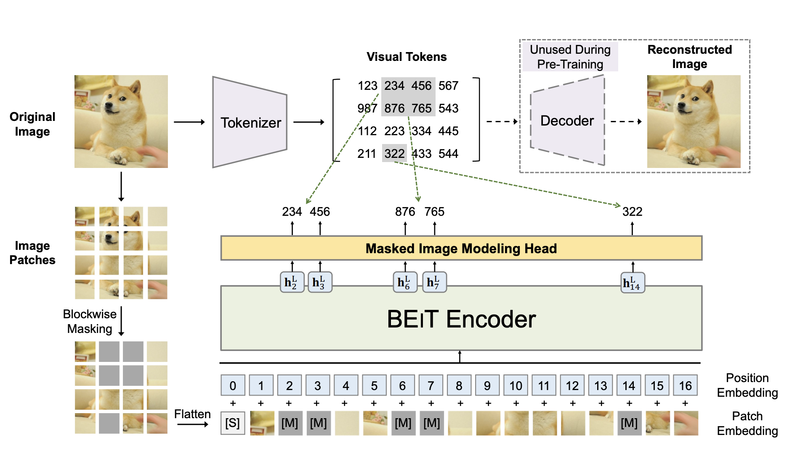
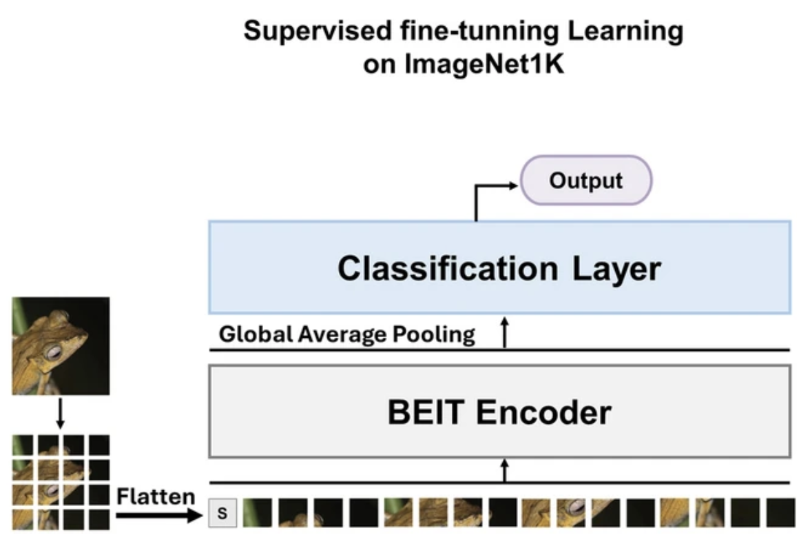

La generación de imagenes y video para hoy abril del 2026 ha sido uno de los elementos de mas ayuda para productividad en la generación de contenido visual, modelos como Nano Banana o Images 2.0 son los que predominan este sector, y existen tambien modelos opensource como flux, stable diffusion o playground v3.

Pero en este post no hablare sobre los beneficios, ni como usarlos, sino que hablare sobre las aplicaciones incorrectas y no eticas que se les ha dado, y son las denominadas deepfakes.

Hay que ser honestos, la tecnologia deepfake crece a pasos agigantados con cada nuevo modelo de frontera, y cada vez mas es imposible reconocer entre un imagen/video generado por una ia que una real, entonces ¿Estamos a merced de vivir en la incertidumbre de que es real o no?, la respuesta es no con ciertos matices.

Aquí entran los denominados _deepfake detection models_ , un modelo de deteccion que ha tomado mucha relevancia a dia de hoy es el propuesto por Aneesa Al Redhaei et al. propone una versión mejorada del sistema BEiT auto-supervisado, donde lo denominan [_BEiT-HPR_](https://link.springer.com/article/10.1007/s10462-025-11286-8) (Hierarchical PatchReducer).

Son términos raros lo se, voy a intentar explicarlo y brindar todas las referencias posibles para explicarlo, BEiT hace referencia a un modelo de visión de computador denominado [_Bidirectional Encoder image of Transformers_](https://arxiv.org/abs/2106.08254) y fue realizada por Hangbo Bao et al para Microsoft Research, este modelo se basa en 3 puntos importantes:

1. Tokenizar una imagen basado en parches de 16x16
2. Emascarar parches, ocultando un 40 % de parches de forma aleatorea
3. Predecir los tokens ocultos utilizando _cross-entropy_ un equivalente al [MSE](https://www.davidcastillo.dev/blog/el-perceptron-y-las-redes-neuronales/) (que vimos en el perceptron) pero aplicado a imagenes.

*Obtenido de BEIT: BERT Pre-Training of Image Transformers | Hangbo Bao et al.*

Penalizando el modelo cuando asigna baja probabilidad, y reduciendo la perdida con cross-entropy.

$$
Loss = -log(P(z_{real} | parches_{visibles})) 
$$

Ahora tomo el hilo del modelo BEiT-HPR, que toma el paso 3 de enmascarar los parches y realiza un pequeño ajuste, utilizando una capa de clasificación y educción de parches jerarquicos justo en la fase de codificación, reduciendo la complejidad computacional y manteniendo una alta precisión de detección.

*Obtenido de A self-supervised BEiT model with a novel hierarchical patchReducer for efficient facial deepfake detection | Aneesa Al Redhaei et al.*

