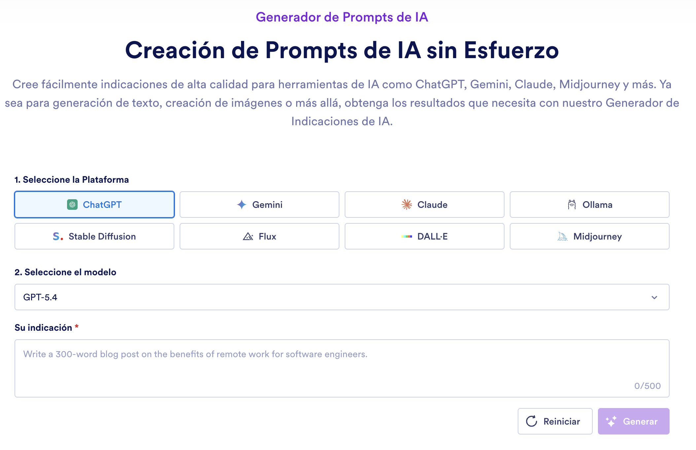
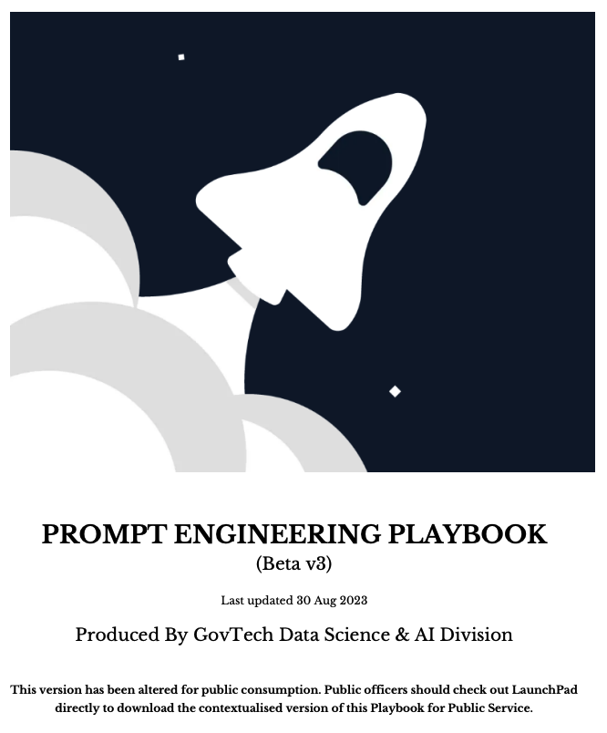
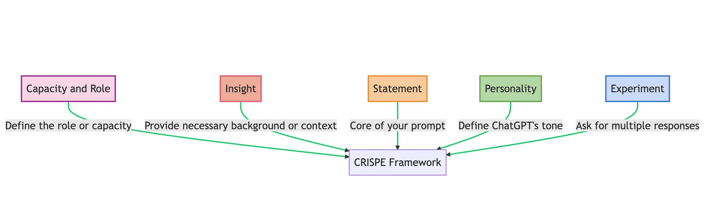
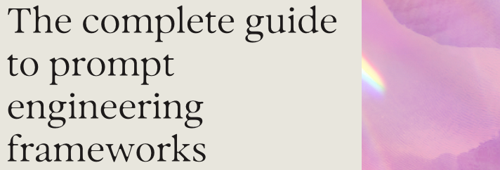

> **tl;dr** El prompt engineering no se trata de escribirle a la IA de forma trivial, sino de reducir ambigüedades. En esta primera parte se revisan marcos de estructura como **RTF**, **CO-STAR** y **CRISPE**, que ayudan a definir rol, contexto, objetivo, tono, audiencia, formato y criterios de respuesta. Al dominarlas puedes ahorrar tokens, obtener respuestas más consistentes y comunicarte mejor con los modelos de IA.

---

Ok, partamos de que todo el mundo ya utiliza los productos de los grandes modelos de IA generativa como Gemini, Chat GPT, Claude, DeepSeek y otros. Pero como te habrás dado cuenta, tienen un costo por tokens, y con el tiempo se te terminan gastando y debes esperar un tiempo para que se recarguen en tu cuenta. 

Esto puede frustrarte si te encuentras en tu estado de foco. Por ello en este post desplegaré técnicas para mejorar y optimizar el uso de tus tokens a través del _prompt engineering_, para que no solo ahorres tokens, sino que tengas una comunicación _profesional_ con el prompter.

Además existe mucha literatura de _prompt engineering_, de la cual he simplificado y clasificado los marcos que he creído que tienen más trascendencia en la comunidad de prompter y que contienen hechos demostrados con artículos indexados.

## Índice

- [¿Qué es realmente el prompt engineering?](#qué-es-realmente-el-prompt-engineering)
- [¿Qué técnicas de prompt engineering existen?](#qué-técnicas-de-prompt-engineering-existen)
- [Marcos de estructura](#marcos-de-estructura)
  - [RTF: Role + Task + Format](#rtf-role--task--format)
  - [CO-STAR: Context + Object + Style + Tone + Audience + Response](#co-star-context--object--style--tone--audience--response)
  - [CRISPE: Capacity + Role + Insight + Statement + Personality + Experiment](#crispe-capacity--role--insight--statement--personality--experiment)
- [Conclusiones y reflexiones de estructuras de prompts](#conclusiones-y-reflexiones-de-estructuras-de-prompts)
- [Referencias](#referencias)

## ¿Qué es realmente el `prompt engineering`?

Prompt engineering es la práctica de diseñar instrucciones para que un modelo de lenguaje produzca resultados útiles, consistentes y verificables. La definición suena sencilla, pero en la práctica cambia mucho dependiendo de si estás usando un chatbot, una API, un modelo de razonamiento, un agente con herramientas o un flujo automatizado dentro de una aplicación.

La idea central es esta: **un buen prompt reduce ambigüedad**. Le dice al modelo qué debe hacer, con qué información debe trabajar, qué debe ignorar, qué formato debe entregar y cómo debe comportarse cuando no tenga suficiente evidencia.

Un prompt débil delega demasiadas decisiones al modelo:

> Hazme un resumen de este documento.

Un prompt más útil delimita el trabajo:

> Resume este documento para un gerente de producto. Extrae decisiones, riesgos, fechas y responsables. Devuelve una tabla con cuatro columnas: tema, evidencia, impacto y siguiente acción. Si un dato no aparece en el documento, escribe "No especificado".

Aquí puedes ver la diferencia entre pedir una opinión y diseñar una operación repetible.

## ¿Qué técnicas de prompt engineering existen?

Existen muchas, pero se puede resumir en 4 clasificaciones:

1. Marcos de estructura
2. Técnicas de Razonamiento
3. Técnicas de Contexto
4. Técnicas de Fiabilidad

Cada una de ellas se puede aplicar dependiendo de la tarea que se vaya a realizar y el modelo de LLM que se utilice, ya que un prompt que funcione en "Gemini" tal vez no tenga la misma respuesta en una que se use en "Chat GPT". En este post solo se verán los marcos de estructura como una inicialización en el prompt engineering.

## Marcos de estructura

Los marcos de estructura son un conjunto de instrucciones para escribir un prompt, y ayudan a que el agente de IA comprenda lo que está buscando el usuario. Entre las más usadas se encuentran la RTF, CO-STAR y CRISPE, que son técnicas creadas por la comunidad prompter y han sido divulgadas fuertemente en las [_Prompt Battles_](https://promptbattle.com/). 

Aunque también podrías utilizar un [generador de prompts](https://www.jotform.com/es/ai/prompt-generator/) didáctico seleccionando la plataforma y el modelo para crear tus prompts, y ahorrarte tiempo. 



### RTF: Role + Task + Format

De acuerdo con [rtfprompt](https://www.rtfprompt.com/framework.php) este marco se define con:

- Un **rol**, por ejemplo: 
>_Actúa como un abogado especialista en derecho laboral_
- Una **tarea**, por ejemplo:
>_Revisa el contrato de trabajo, analiza las cláusulas de protección de la empresa, riesgos laborales y beneficios que falten._
- Un **formato** entregable, por ejemplo:
>_Entrégame un resumen ejecutivo, con los principales riesgos encontrados, cláusulas delicadas, beneficios faltantes, y recomendaciones en un archivo .docx._

Construyendo prompt como el siguiente:
>_Actúa como un abogado especialista en derecho laboral. Revisa el contrato de trabajo, analiza las cláusulas de protección de la empresa, riesgos laborales y beneficios que falten. Entrégame un resumen ejecutivo, con los principales riesgos encontrados, cláusulas delicadas, beneficios faltantes, y recomendaciones en un archivo .docx._

Además se puede agregar el tono, audiencia, meta, CTA (llamada a la acción) y longitud de respuesta para afinar y detallar aún más lo que se espera.

### CO-STAR: Context + Object + Style + Tone + Audience + Response
Esta estructura nació en el Gobierno de Singapur, y fue popularizada por Sheila Teo en la [primera competencia de prompt engineering en ese país](https://medium.com/data-science/how-i-won-singapores-gpt-4-prompt-engineering-competition-34c195a93d41). La primera evidencia formal aparece en el [playbook de prompt engineering de GovTech Singapore](https://www.developer.tech.gov.sg/products/collections/data-science-and-artificial-intelligence/playbooks/prompt-engineering-playbook-beta-v3.pdf) y forma parte de la literatura del departamento de GovTech.



En este mismo playbook menciona que el funcionamiento consiste en crear:

- Un **Contexto**: la información de fondo que el modelo necesita para entender la situación. Puede incluir el producto, problema, restricciones, datos disponibles o decisiones previas.
- Un **Objetivo** _(Objective)_: la tarea concreta que debe resolver. Mientras más específico sea el objetivo, menos espacio queda para respuestas genéricas.
- Un **Estilo** _(Style)_: la forma de escritura o tipo de pieza que quieres producir. Por ejemplo: memo ejecutivo, correo comercial, análisis técnico, guía paso a paso o publicación de LinkedIn.
- Un **Tono**: la actitud comunicacional de la respuesta. Puede ser formal, directo, pedagógico, persuasivo, sobrio, cercano o crítico.
- Una **Audiencia**: la persona o grupo que recibirá la respuesta. No es lo mismo escribir para un CEO, un equipo técnico, un cliente molesto o un estudiante principiante.
- Una **Respuesta** esperada: el formato final de entrega. Aquí defines si quieres una tabla, JSON, lista de acciones, resumen ejecutivo, plantilla de correo o pasos numerados.

El valor de CO-STAR está en que separa partes que normalmente mezclamos en una sola frase. En lugar de decir "hazme un post profesional sobre mi producto", obligas al prompt a declarar el contexto, el objetivo, el estilo, el tono, la audiencia y la salida. Eso reduce ambigüedad y ahorra iteraciones.

Ejemplo:

```txt
Contexto:
Tengo una startup SaaS que ayuda a equipos de ventas B2B a priorizar leads usando datos de CRM. Vamos a lanzar una nueva funcionalidad de scoring predictivo.

Objetivo:
Redacta un correo de lanzamiento para usuarios actuales, explicando el beneficio de la nueva funcionalidad y motivando a probarla esta semana.

Estilo:
Correo breve de producto, parecido a una comunicación de una empresa SaaS moderna.

Tono:
Claro, directo y confiable. Evita exageraciones y frases demasiado publicitarias.

Audiencia:
Gerentes de ventas y revenue operations que ya usan la plataforma.

Respuesta:
Entrega 3 asuntos de correo y una versión final del email de máximo 180 palabras. Incluye una llamada a la acción al final.
```

Construyendo el prompt completo:

> Tengo una startup SaaS que ayuda a equipos de ventas B2B a priorizar leads usando datos de CRM. Vamos a lanzar una nueva funcionalidad de scoring predictivo. Redacta un correo de lanzamiento para usuarios actuales, explicando el beneficio de la nueva funcionalidad y motivando a probarla esta semana. Usa un estilo de correo breve de producto, parecido a una comunicación de una empresa SaaS moderna. El tono debe ser claro, directo y confiable, sin exageraciones ni frases demasiado publicitarias. La audiencia son gerentes de ventas y revenue operations que ya usan la plataforma. Entrega 3 asuntos de correo y una versión final del email de máximo 180 palabras. Incluye una llamada a la acción al final.

CO-STAR es especialmente útil para tareas de comunicación, marketing, documentación, soporte, educación y análisis ejecutivo, porque obliga a definir para quién se escribe y cómo debe verse la respuesta final.

### CRISPE: Capacity + Role + Insight + Statement + Personality + Experiment

CRISPE es un marco más detallado para prompts donde necesitas controlar no solo la tarea, sino también el enfoque de análisis, la personalidad de la respuesta y la forma de iterar sobre el resultado. **Es útil cuando no quieres una respuesta rápida, sino una salida más elaborada** y ajustada a un contexto específico.

Su funcionamiento consiste en definir:

- Una **Capacidad** _(Capacity)_: qué tipo de habilidad debe usar el modelo. Por ejemplo: análisis estratégico, redacción técnica, revisión legal, diseño de producto, debugging o investigación.
- Un **Rol** _(Role)_: desde qué posición debe responder. Puede ser consultor, editor, arquitecto de software, analista financiero, profesor, abogado o gerente de producto.
- Un **Insight**: información clave que debe considerar. Aquí puedes incluir datos, restricciones, hipótesis, problemas conocidos o aprendizajes previos.
- Una **Declaración** _(Statement)_: la instrucción principal del prompt. Es la tarea expresada de forma directa.
- Una **Personalidad** _(Personality)_: el estilo de comunicación esperado. Puede ser claro, crítico, paciente, sobrio, persuasivo, didáctico o ejecutivo.
- Un **Experimento** _(Experiment)_: una variación, prueba o alternativa que quieres explorar. Sirve para pedir opciones, comparar enfoques o validar distintas rutas.



[El valor de CRISPE](https://sourcingdenis.medium.com/crispe-prompt-engineering-framework-e47eaaf83611) está en que empuja al modelo a trabajar con más intención. No solo le dices qué hacer, sino desde qué capacidad debe operar, qué información debe priorizar, cómo debe comunicar y qué variaciones debe probar.

Ejemplo:

```txt
Capacidad:
Usa habilidades de análisis de producto y experiencia de usuario para evaluar una funcionalidad SaaS.

Rol:
Actúa como un product manager senior especializado en productos B2B.

Insight:
Los usuarios actuales abandonan el flujo de onboarding en el paso donde deben conectar su CRM. El equipo sospecha que el problema es falta de claridad y miedo a compartir datos.

Declaración:
Analiza el problema y propone mejoras para reducir la fricción en ese paso del onboarding.

Personalidad:
Responde de forma clara, crítica y práctica. Evita teoría genérica.

Experimento:
Entrega 3 alternativas de solución: una de bajo esfuerzo, una intermedia y una ambiciosa. Para cada una incluye impacto esperado, riesgo y métrica de validación.
```

Construyendo el prompt completo:

> Usa habilidades de análisis de producto y experiencia de usuario para evaluar una funcionalidad SaaS. Actúa como un product manager senior especializado en productos B2B. Los usuarios actuales abandonan el flujo de onboarding en el paso donde deben conectar su CRM. El equipo sospecha que el problema es falta de claridad y miedo a compartir datos. Analiza el problema y propone mejoras para reducir la fricción en ese paso del onboarding. Responde de forma clara, crítica y práctica, evitando teoría genérica. Entrega 3 alternativas de solución: una de bajo esfuerzo, una intermedia y una ambiciosa. Para cada una incluye impacto esperado, riesgo y métrica de validación.

CRISPE funciona bien para tareas donde necesitas criterio, comparación y alternativas. Es especialmente útil en estrategia, producto, arquitectura de software, análisis de negocio, documentación compleja, revisión de ideas y toma de decisiones. Puedes usar el siguiente [generador de prompts CRISPE](https://github.com/BaseMax/CRISPE-prompt-generator) para usarlo con tus LLMs.

## Conclusiones y reflexiones de estructuras de prompts

Existen más marcos de estructura para generar un prompt. Generalmente los llaman frameworks y, como se mencionó antes, estos nacen de la comunidad y de las competencias de prompting. Otros marcos que puedes investigar son BAB, Tree of thought, RACE, FIVE S y Agile, entre otros. Puedes visitar el post [**"The complete guide to prompt engineering frameworks"**](https://www.parloa.com/knowledge-hub/prompt-engineering-frameworks/) escrito por Anjana Vasan, en el cual se da una visión más completa sobre estos marcos y es la fuente principal de esta sección.



Aunque he dividido solo en 3, debido a que es suficiente para comprender las estructuras de prompting.


| Framework | Cuándo aplicarlo | Cuándo NO usarlo |
|-----------|-----------------|-----------------|
| **RTF** (Role · Task · Format) | - Tareas simples y repetitivas<br>- Necesitas un formato exacto (JSON, tabla, lista)<br>- Scripts y automatizaciones<br>- Prompts del día a día | - Tareas complejas de múltiples pasos<br>- Requieren razonamiento profundo o iteración<br>- El tono y estilo son críticos en el output |
| **CO-STAR** (Context · Objective · Style · Tone · Audience · Response) | - Prompts de sistema (system prompt)<br>- Contenido con marca o voz específica<br>- Redacción profesional o institucional<br>- Cuando el tono importa mucho | - Tareas rápidas o de código<br>- Cuando el tono y estilo no importan<br>- Prompts simples de una sola instrucción |
| **CRISPE** (Capacity · Role · Insight · Statement · Personality · Experiment) | - Prompts plantilla reutilizables<br>- Quieres comparar varias respuestas (Experiment)<br>- Asistentes especializados con contexto complejo<br>- Explorar distintos enfoques de una tarea | - Respuestas únicas o rápidas<br>- Su complejidad no justifica tareas simples<br>- Cuando no necesitas variantes del output |

En sí podrás notar que cada una de las mencionadas tiene campos repetitivos y que se parecen mucho. Por ejemplo, colocar el formato que deseas para la conversación, estructurar el contexto de la consulta, a quién va dirigido, etc. En mi experiencia utilizo una combinación CO-STAR para empezar prompts, y la comunicación siguiente la realizo con lenguaje coloquial.

## Referencias

- BaseMax. (s. f.). *CRISPE prompt generator* [Repositorio de GitHub]. GitHub. Recuperado el 10 de mayo de 2026, de https://github.com/BaseMax/CRISPE-prompt-generator
- Dinkevych, D. (2023, 23 de mayo). *CRISPE: ChatGPT prompt engineering framework*. Medium. https://sourcingdenis.medium.com/crispe-prompt-engineering-framework-e47eaaf83611
- Government Technology Agency of Singapore. (2023, 30 de agosto). *Prompt engineering playbook* (Beta v3). GovTech Singapore. https://www.developer.tech.gov.sg/products/collections/data-science-and-artificial-intelligence/playbooks/prompt-engineering-playbook-beta-v3.pdf
- Jotform. (s. f.). *Generador de prompts de IA*. Recuperado el 10 de mayo de 2026, de https://www.jotform.com/es/ai/prompt-generator/
- Prompt Battle. (s. f.). *Documentation of all Prompt Battles*. Recuperado el 10 de mayo de 2026, de https://promptbattle.com/
- RTF Prompt. (s. f.). *RTF prompt framework*. Recuperado el 10 de mayo de 2026, de https://www.rtfprompt.com/framework.php
- Teo, S. (2023, 29 de diciembre). *How I won Singapore's GPT-4 prompt engineering competition*. Medium. https://medium.com/data-science/how-i-won-singapores-gpt-4-prompt-engineering-competition-34c195a93d41
- Vasan, A. (2025, 6 de agosto). *The complete guide to prompt engineering frameworks*. Parloa. https://www.parloa.com/knowledge-hub/prompt-engineering-frameworks/
